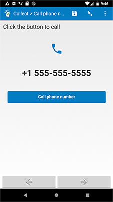

# Phone call dialer

## Description

This field plug-in can dial a phone number for you in SurveyCTO Collect. Simply supply a valid phone number as a parameter (see the sample form for an example), and this field plug-in will allow you to dial that phone number automatically. This can be useful in CATI (computer assisted telephone interviews) surveys to save time and ensure the correct phone number is used.

For a more detailed guide to the **phone-call-dialer** field plug-in, see [the wiki](https://github.com/surveycto/call-phone-number/wiki/Guide-to-the-%22call-phone-number%22-field-plug-in).

## Features

* Supports the `text` field type, but doesn't provide an actual text input. 

## How the response is stored

> [`TIMESTAMP`] The following phone number was called:  `phone_number`.

* This response will use the `phone_number` value from the parameter, and `TIMESTAMP` will be the current date and time.
* If you're using iOS or web forms, this response will be appended to the response (on a new line) whenever the main button is clicked.
* If you're using Android, this response will be appended to the response (on a new line) if the dialer app was successfully launched.

> [`TIMESTAMP`] Failure calling the following phone number: `phone_number`.

* If you're using Android, the above response will be appended to the current response (on a new line) if there was an error launching the dialer app.

## How to use

1. Download the sample form [extras/sample-form](https://github.com/surveycto/phone-call-dialer/raw/master/extras/test-form/Call%20phone%20number.xlsx) from this repo and upload it to your SurveyCTO server.
1. Download the [phone-call-dialer.fieldplugin.zip](https://github.com/surveycto/phone-call-dialer/raw/master/phone-call-dialer.fieldplugin.zip) file from this repo, and attach it to the test form on your SurveyCTO server.
1. Make sure to provide the correct parameters (see below).

## Parameters

| Key | Value |
| --- | --- |
| `phone_number` (required) | The phone number to dial. |
| `button_label` (optional) | The label of the button used to make the phone call. If no `button_label` parameter is specified, the button will be labeled "Click here to call". |

**Note:** it is suggested to use values stored in other fields for the parameters. Take a look at the sample form to see how this is accomplished.

## More resources

* **Sample form**  
[extras/test-form](https://github.com/surveycto/phone-call-dialer/raw/master/extras/test-form/Call%20phone%20number.xlsx)
* **Developer documentation**  
Instructions and resources for developing your own field plug-ins.  
[https://github.com/surveycto/Field-plug-in-resources](https://github.com/surveycto/Field-plug-in-resources)
* **User documentation**  
How to get started using field plug-ins in your SurveyCTO form.  
[https://docs.surveycto.com/02-designing-forms/03-advanced-topics/06.using-field-plug-ins.html](https://docs.surveycto.com/02-designing-forms/03-advanced-topics/06.using-field-plug-ins.html)
